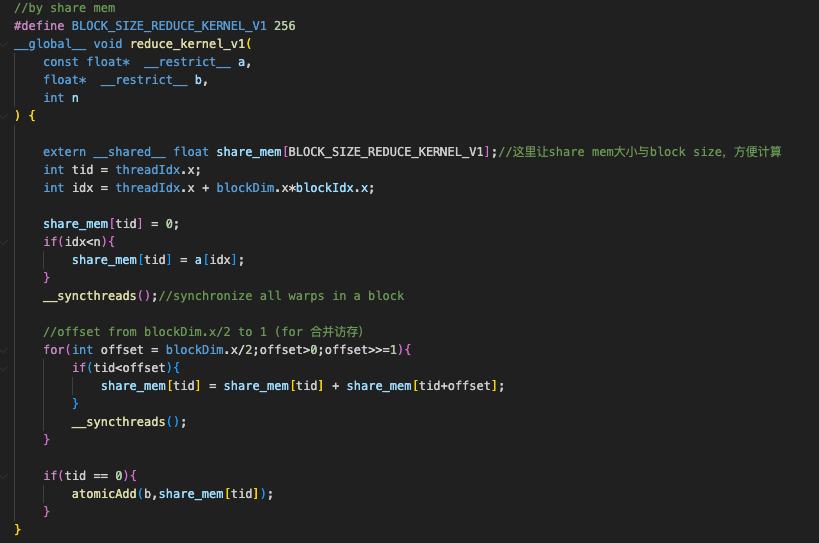
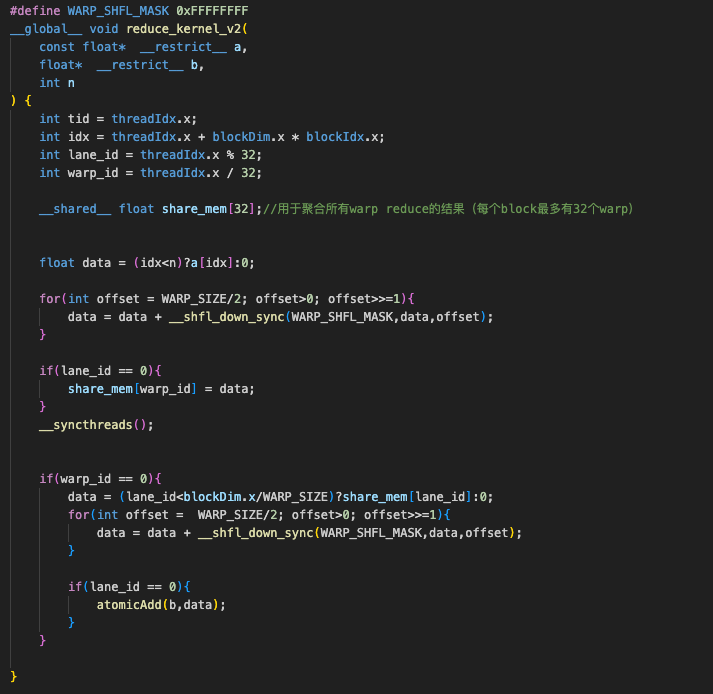
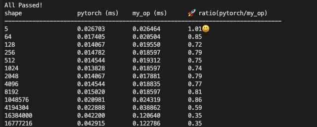
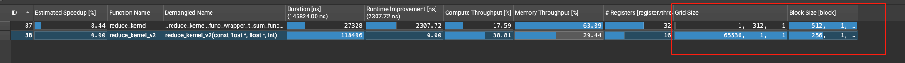

# v0
reduce最原始的写法就是下面这种
```c
__global__ void reduce(const float* input, float* output, int N) {
    int idx = blockDim.x * blockIdx.x + threadIdx.x;
    if (idx < N) atomicAdd(output, input[idx]);
}
```
最大的问题就是每个线程都需要顺序执行这个原子操作，并行度极低

# v1
通过share mem折半归约，每个线程计算一半，最后再reduce



# v2
用warp shfl函数折半归约，减少share mem消耗和一次__syncthreads




但经测试，v1和v2的性能貌似都差不多,下图是v2版本与pytorch对比数据，可以看到在大shape情况下性能极差



ncu观察了一下结果，下图是shape = 16777216 下的信息，发现pytorch的gridsize比我的配置小多了，于是我认为应该是我的gridsize太大，导致最后的atomicAdd原子操作太耗时（每个block最后需要做一次atomicAdd，那么65536个block最后就要顺序做65536次原子操作）




# v3
 